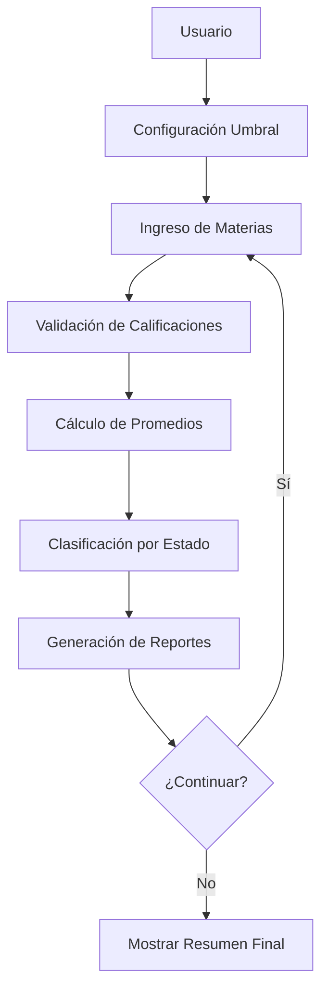
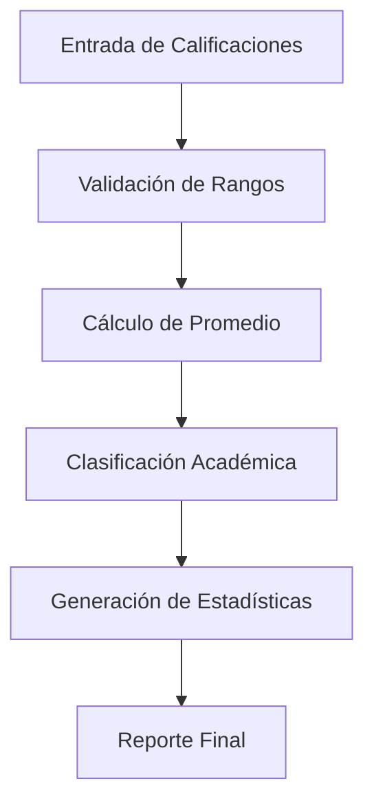
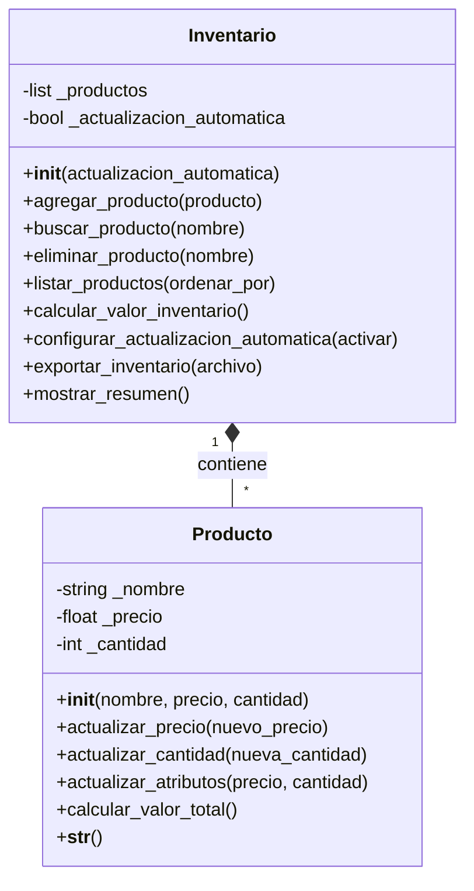
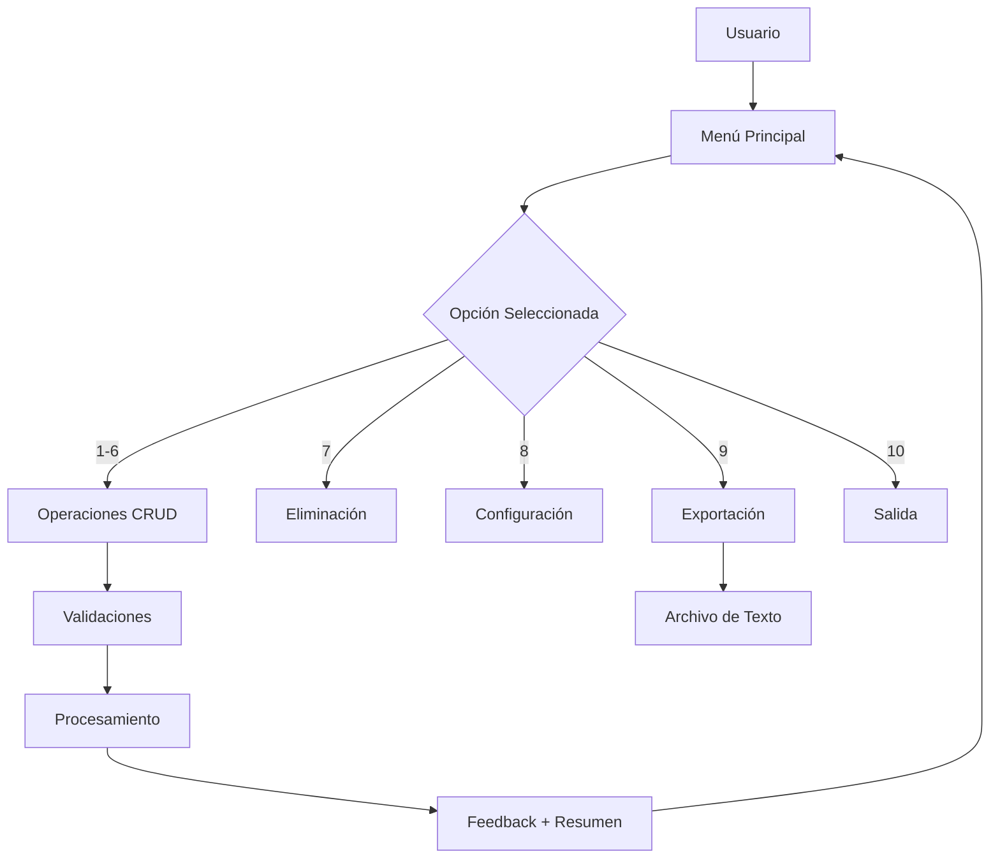
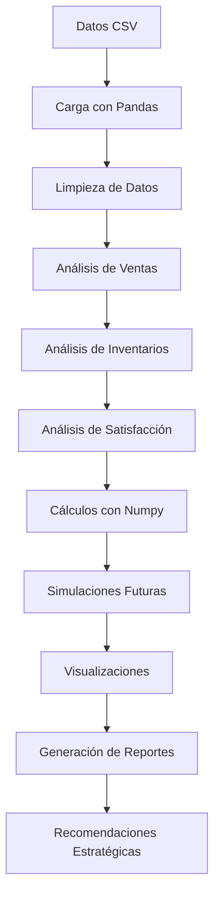
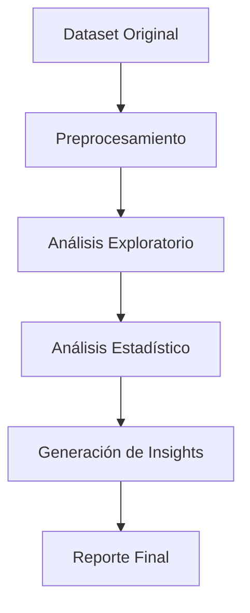

# Curso de Programación en Python - UNIR

<div align="center">


**Portafolio completo de proyectos académicos desarrollados en Python**

*Máster Universitario en Inteligencia Artificial - Universidad Internacional de La Rioja*

---

[**Inicio Rápido**](#inicio-rápido) • [**Documentación**](#documentación) • [**Características**](#características) • [**Instalación**](#instalación) • [**Autoría**](#autoría)

</div>

---

## Descripción del Portafolio

Este repositorio contiene una **colección completa de proyectos académicos** desarrollados en Python como parte del Máster Universitario en Inteligencia Artificial de la UNIR. Cada proyecto demuestra diferentes aspectos de la programación en Python, desde conceptos básicos hasta paradigmas avanzados.

### Proyectos Incluidos

- ✅ **Trabajo 1**: Calculadora de Promedios Escolares - Sintaxis y Estructuras Básicas
- ✅ **Trabajo 2**: Sistema de Inventario POO - Programación Orientada a Objetos
- ✅ **Trabajo 3**: Análisis de Red de Tiendas - Pandas y Numpy para Análisis de Datos
- ✅ **Trabajo 4**: Análisis de Visualizaciones - Matplotlib y Seaborn
- ✅ **Documentación Completa**: Cada proyecto incluye documentación técnica exhaustiva
- ✅ **Estándares Profesionales**: Código limpio, validaciones robustas y manejo de errores

---

## Inicio Rápido

### Clonar el Repositorio
```bash
git clone <URL_DEL_REPOSITORIO>
cd Curso_Python_UNIR
```

### Ejecutar los Proyectos

#### **Trabajo 1: Calculadora de Promedios**
```bash
# Navegar al directorio del trabajo
cd trabajo_1

# Ejecutar el programa
python trabajo_1_sintaxis_python.py
```

#### **Trabajo 2: Sistema de Inventario**
```bash
# Navegar al directorio del trabajo
cd trabajo_2

# Ejecutar el sistema
python trabajo_2_Sistema_Inventario_POO.py
```

#### **Trabajo 3: Análisis de Red de Tiendas**
```bash
# Navegar al directorio del trabajo
cd trabajo_3

# Instalar dependencias
pip install pandas numpy jupyter

# Ejecutar el notebook
jupyter notebook
# Abrir: analisis_red_tiendas.ipynb
```

#### **Trabajo 4: Análisis de Visualizaciones**
```bash
# Navegar al directorio del trabajo
cd trabajo_4

# Ejecutar el análisis
python analisis_ventas_minoristas.py
# Salida: genera fig_resumen_subplots.png y muestra gráficos en pantalla
```

---

## Características del Portafolio

### Trabajo 1: Calculadora de Promedios Escolares
| **Funcionalidad** | **Descripción** | **Estado** |
|:---|:---|:---:|
| **Ingreso Dinámico** | Número ilimitado de materias y calificaciones | ✅ |
| **Validaciones Robustas** | Rango 0.0 - 10.0 con reintentos automáticos | ✅ |
| **Cálculos Automáticos** | Promedio aritmético y clasificación por estado | ✅ |
| **Umbral Configurable** | Personalizable por el usuario | ✅ |
| **Reportes Detallados** | Análisis completo con formato profesional | ✅ |

### Trabajo 2: Sistema de Inventario POO
| **Funcionalidad** | **Descripción** | **Estado** |
|:---|:---|:---:|
| **CRUD Completo** | Agregar, buscar, actualizar y eliminar productos | ✅ |
| **Validaciones Avanzadas** | Tipos de datos, rangos y lógica de negocio | ✅ |
| **Gestión Financiera** | Cálculo de valores por producto e inventario total | ✅ |
| **Configuración Inteligente** | Modo automático/manual para duplicados | ✅ |
| **Interfaz Profesional** | Menú interactivo con 9 opciones | ✅ |

### Trabajo 3: Análisis de Red de Tiendas
| **Funcionalidad** | **Descripción** | **Estado** |
|:---|:---|:---:|
| **Carga de Datos** | Lectura y limpieza de archivos CSV | ✅ |
| **Análisis de Ventas** | Cálculo de totales por producto, tienda y categoría | ✅ |
| **Gestión de Inventarios** | Rotación y niveles críticos | ✅ |
| **Satisfacción del Cliente** | Evaluación y correlación con rendimiento | ✅ |
| **Estadísticas con Numpy** | Mediana, desviación estándar y simulaciones | ✅ |
| **Proyecciones Futuras** | Simulación de ventas para 3 meses | ✅ |
| **Análisis de Correlaciones** | Relaciones entre ventas e inventarios | ✅ |
| **Detección de Anomalías** | Identificación de tiendas con bajo rendimiento | ✅ |
| **Reportes Automáticos** | Generación de insights y recomendaciones | ✅ |
| **Validación de Datos** | Verificación de integridad y consistencia | ✅ |

### Trabajo 4: Análisis de Visualizaciones
| **Funcionalidad** | **Descripción** | **Estado** |
|:---|:---|:---:|
| **Carga de Dataset** | Lectura de `superstore_dataset2012.csv` (latin-1) | ✅ |
| **Preparación** | Conversión de fechas y creación de `Order Month` | ✅ |
| **Univariante Matplotlib** | Histograma de `Sales` | ✅ |
| **Univariante Seaborn** | Barras de frecuencia por `Category` | ✅ |
| **Bivariante Matplotlib** | Dispersión `Sales` vs `Profit` | ✅ |
| **Bivariante Seaborn** | `boxplot` `Profit` por `Category`, `regplot` | ✅ |
| **Multivariante Seaborn** | Heatmap de correlaciones | ✅ |
| **Subplots 2x2** | Figura combinada con título general | ✅ |
| **Guardado de imagen** | `fig_resumen_subplots.png` | ✅ |

### Características Comunes
- **Documentación Exhaustiva**: Cada proyecto incluye documentación técnica completa
- **Manejo de Errores**: Sistemas robustos de validación y recuperación
- **Estándares de Calidad**: Código limpio siguiendo PEP 8 y mejores prácticas
- **Métricas de Calidad**: Análisis detallado de funcionalidades y código

---

## Arquitectura de los Proyectos

### Trabajo 1: Calculadora de Promedios Escolares
#### **Arquitectura del Sistema**


#### **Flujo de Datos**


---

### Trabajo 2: Sistema de Inventario POO
#### **Arquitectura de Clases**


#### **Flujo de Operaciones**


> **Funcionalidades Extra**: El sistema incluye características adicionales como exportación, ordenamiento avanzado y actualización simultánea de atributos, que enriquecen la experiencia sin ser requeridas por el enunciado.

---

### Trabajo 3: Análisis de Red de Tiendas
#### **Arquitectura del Sistema**


#### **Flujo de Análisis**


---

### Trabajo 4: Análisis de Visualizaciones
#### **Flujo del Script**
```mermaid
graph TD
    A[CSV local superstore_dataset2012] --> B[Carga y preparación (pandas)]
    B --> C[Univariante Matplotlib: hist Sales]
    B --> D[Univariante Seaborn: barras Category]
    B --> E[Bivariante Matplotlib: scatter Sales-Profit]
    B --> F[Bivariante Seaborn: box Profit por Category]
    B --> G[Seaborn: regplot Sales-Profit]
    B --> H[Seaborn: heatmap correlaciones]
    C --> I[Subplots 2x2]
    D --> I
    E --> I
    F --> I
    I --> J[Guardar fig_resumen_subplots.png]
```

#### **Configuración Visual**
- `sns.set_theme(style="whitegrid", palette="Set2")`
- Títulos y etiquetas en cada gráfico; rotación en categorías

## Documentación

### Archivos Disponibles

| **Documento** | **Descripción** | **Propósito** |
|:---|:---|:---:|
| **README.md** | Este archivo | Presentación del portafolio |
| **trabajo_1/** | Calculadora de Promedios Escolares | Proyecto de sintaxis básica |
| **trabajo_2/** | Sistema de Inventario POO | Proyecto de programación orientada a objetos |
| **trabajo_3/** | Análisis de Red de Tiendas | Proyecto de análisis de datos con Pandas y Numpy |
| **trabajo_4/** | Análisis de Visualizaciones | Proyecto de visualización con Matplotlib y Seaborn |

### Documentación por Proyecto

#### **Trabajo 1: Calculadora de Promedios**
- **Documentación Técnica**: `trabajo_1/DOCUMENTACION_TECNICA_TRABAJO1.md`
- **Código Fuente**: `trabajo_1/trabajo_1_sintaxis_python.py`

#### **Trabajo 2: Sistema de Inventario**
- **Documentación Técnica**: `trabajo_2/DOCUMENTACION_TECNICA_TRABAJO2.md`
- **Código Fuente**: `trabajo_2/trabajo_2_Sistema_Inventario_POO.py`

#### **Trabajo 3: Análisis de Red de Tiendas**
- **Documentación Técnica**: `trabajo_3/DOCUMENTACION_TECNICA_TRABAJO3.md`
- **Código Fuente**: `trabajo_3/analisis_red_tiendas.ipynb`

#### **Trabajo 4: Análisis de Visualizaciones**
- **Documentación Técnica**: `trabajo_4/DOCUMENTACION_TECNICA_TRABAJO4.md`
- **Código Fuente**: `trabajo_4/analisis_ventas_minoristas.py`

---

## Instalación

### Requisitos Previos
- **Python**: 3.6 o superior
- **Sistema Operativo**: Windows, macOS, Linux
- **Memoria**: 128 MB disponible
- **Almacenamiento**: 1 MB

### Pasos de Instalación
Consulta la sección "Inicio Rápido" para los comandos y flujo de ejecución.

### Solución de Problemas Comunes

| **Error** | **Solución** |
|:---|:---|
| `python: command not found` | Usar `python3` en lugar de `python` |
| `No module named` | Ejecutar directamente, no como import |
| `Permission denied` | Verificar permisos del archivo |

---

## Ejemplos de Uso

### Trabajo 1: Calculadora de Promedios
Ver "Inicio Rápido" para ejecutar. Tras iniciar, sigue el flujo guiado y revisa el resumen final.

### Trabajo 2: Sistema de Inventario
Ver "Inicio Rápido" para ejecutar. Usa el menú interactivo (1-9) para operar el inventario.

### Trabajo 3: Análisis de Red de Tiendas
Ver "Inicio Rápido" para ejecutar el notebook y seguir el análisis paso a paso.

### Trabajo 4: Análisis de Visualizaciones
Ver "Inicio Rápido" para ejecutar el script y comprobar la imagen generada.

#### **Ejemplos de Análisis Realizados**
- **Análisis de Ventas**: Total por producto y por tienda
- **Cálculo de Ingresos**: Cantidad vendida × Precio unitario
- **Rotación de Inventarios**: Porcentaje vendido por tienda
- **Análisis de Satisfacción**: Correlación con rendimiento de ventas
- **Estadísticas con Numpy**: Mediana, desviación estándar, simulaciones
- **Proyecciones Futuras**: Simulación de ventas para 3 meses

### Datos de Prueba Sugeridos

#### **Trabajo 1: Calificaciones**
```
Materia 1: Matemáticas, 8.5
Materia 2: Historia, 7.0
Materia 3: Física, 9.2
Materia 4: Literatura, 6.8
Materia 5: Química, 8.9
```

#### **Trabajo 2: Productos**
```
Producto 1: Laptop Dell, $1200.50, 10 unidades
Producto 2: Mouse Inalámbrico, $25.99, 50 unidades
Producto 3: Teclado Mecánico, $89.99, 25 unidades
Producto 4: Monitor 24" 4K, $299.99, 15 unidades
Producto 5: Webcam HD, $79.99, 30 unidades
```

#### **Trabajo 3: Datos de Red de Tiendas**
```
Archivos CSV incluidos en trabajo_3/:
- ventas.csv: Producto, Tienda, Cantidad, Precio_Unitario, Fecha
- inventarios.csv: Producto, Tienda, Stock_Actual, Stock_Minimo, Fecha
- satisfaccion.csv: Tienda, Puntuacion, Num_Clientes, Fecha

Ejemplo de datos de ventas:
Producto: Laptop, Tienda: Centro, Cantidad: 15, Precio: 1200, Fecha: 2024-01-15
Producto: Mouse, Tienda: Norte, Cantidad: 50, Precio: 25, Fecha: 2024-01-15
Producto: Teclado, Tienda: Sur, Cantidad: 30, Precio: 89, Fecha: 2024-01-15
```

---

## Manejo de Errores

### Tipos de Validación
- **Nivel 1**: Validación de tipos de datos
- **Nivel 2**: Validación de rangos de valores
- **Nivel 3**: Validación de lógica de negocio

### Excepciones Manejadas
- `ValueError`: Valores fuera de rango
- `TypeError`: Tipos de datos incorrectos
- `KeyboardInterrupt`: Interrupción del usuario
- `Exception`: Errores inesperados

### Mensajes de Error

#### **Trabajo 1: Calculadora de Promedios**
```
Error: Debe ingresar un número decimal válido. Valor ingresado: 'abc'
Error: La calificación debe estar entre 0.0 y 10.0. Valor ingresado: 15.0
```

#### **Trabajo 2: Sistema de Inventario**
```
Error al actualizar precio: El precio debe ser positivo, se recibió: -50.0
Error: La cantidad debe ser un número entero positivo
Error: Producto no encontrado en el inventario
```

#### **Trabajo 3: Análisis de Red de Tiendas**
```
Error: No se pudo cargar el archivo CSV 'ventas.csv'
Error: Columna 'Nivel_Satisfaccion' no encontrada en el dataset
Error: Datos de inventario inconsistentes con ventas
Error: No hay datos suficientes para el análisis estadístico
```

---

## Autoría

### Desarrolladora
**Lorelay Pricop Florescu**
- **Titulación**: Graduada en Tecnología Interactiva
- **Perfil Profesional**: Tecnóloga y Project Manager
- **Formación Actual**: Máster Universitario en Inteligencia Artificial
- **Especialidad**: IA Generativa para Aplicaciones Empresariales
- **Universidad**: UNIR (Universidad Internacional de La Rioja)

### Contacto Profesional
[](https://www.linkedin.com/in/lorelaypricop)
[](mailto:lorelaypricop@gmail.com)

---

## Contexto Académico

### Información del Curso
- **Institución**: Universidad Internacional de La Rioja (UNIR)
- **Programa**: Máster Universitario en Inteligencia Artificial
- **Curso**: Programación en Python
- **Período**: Agosto 2025

---

## Transparencia en el Uso de IA

### Declaración de Transparencia Académica

En cumplimiento con los estándares de transparencia académica:

- **Código Fuente**: Desarrollado íntegramente por la autora
- **Lógica y Algoritmos**: Diseño e implementación original
- **Documentación**: Elaborada con asistencia de IA Generativa para formato y presentación
- **Contenido Técnico**: Validado y verificado por la autora

**Esta declaración refleja el uso responsable y transparente de tecnologías emergentes en el contexto académico.**

---

## Licencia

### Licencia Académica
Este proyecto está desarrollado como parte de un programa académico de la Universidad Internacional de La Rioja (UNIR). 

**© Agosto 2025 - Lorelay Pricop Florescu**  
*Todos los derechos reservados*

---

## Contribuciones

### Política de Contribuciones
Este es un proyecto académico individual desarrollado para cumplir con los requisitos del curso de Programación en Python. No se aceptan contribuciones externas en este momento.

### Sugerencias y Feedback
Para sugerencias, preguntas o feedback sobre el proyecto:
- **Email**: lorelaypricop@gmail.com
- **LinkedIn**: [@lorelaypricop](https://www.linkedin.com/in/lorelaypricop)

---

## Estructura del Repositorio

```
Curso_Python_UNIR/
├── README.md                           # Este archivo
├── .gitignore                          # Configuración de Git
├── trabajo_1/                          # Calculadora de Promedios Escolares
│   ├── trabajo_1_sintaxis_python.py
│   └── DOCUMENTACION_TECNICA_TRABAJO1.md
├── trabajo_2/                          # Sistema de Inventario POO
│   ├── trabajo_2_Sistema_Inventario_POO.py
│   └── DOCUMENTACION_TECNICA_TRABAJO2.md
├── trabajo_3/                          # Análisis de Red de Tiendas
│   ├── analisis_red_tiendas.ipynb
│   ├── ventas.csv
│   ├── inventarios.csv
│   ├── satisfaccion.csv
│   └── DOCUMENTACION_TECNICA_TRABAJO3.md
└── trabajo_4/                          # Análisis de Visualizaciones
    ├── analisis_ventas_minoristas.py
    ├── superstore_dataset2012.csv
    └── DOCUMENTACION_TECNICA_TRABAJO4.md
```

---

<div align="center">

**UNIVERSIDAD INTERNACIONAL DE LA RIOJA**  
*Máster Universitario en Inteligencia Artificial*  
*Curso de Programación en Python*


</div>
