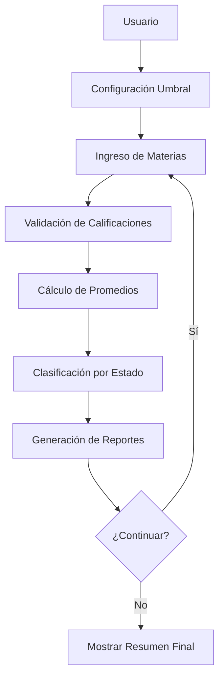
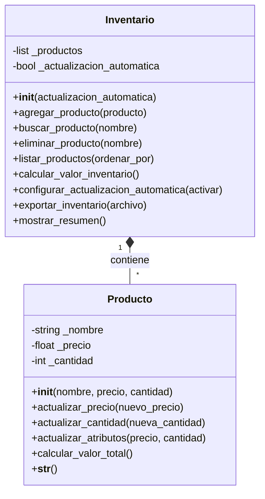
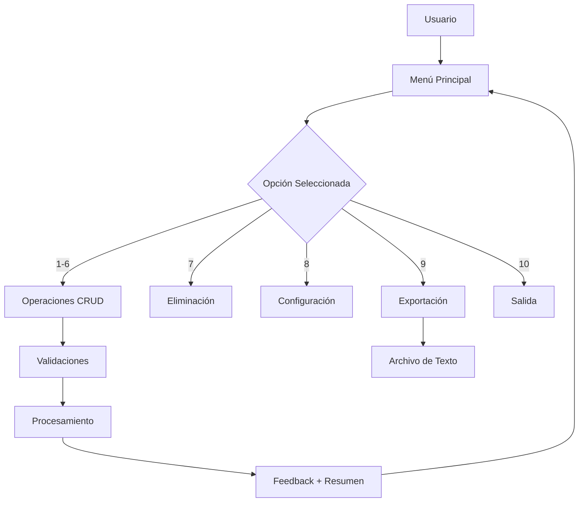

# 🎓 Curso de Programación en Python - UNIR

<div align="center">


**Portafolio completo de proyectos académicos desarrollados en Python**

*Máster Universitario en Inteligencia Artificial - Universidad Internacional de La Rioja*

---

[🚀 **Inicio Rápido**](#-inicio-rápido) • [📚 **Documentación**](#-documentación) • [💻 **Características**](#-características) • [🎯 **Instalación**](#-instalación) • [👩‍💻 **Autoría**](#-autoría)

</div>

---

## 📋 Descripción del Portafolio

Este repositorio contiene una **colección completa de proyectos académicos** desarrollados en Python como parte del Máster Universitario en Inteligencia Artificial de la UNIR. Cada proyecto demuestra diferentes aspectos de la programación en Python, desde conceptos básicos hasta paradigmas avanzados.

### 🎯 **Proyectos Incluidos**

- ✅ **Trabajo 1**: Calculadora de Promedios Escolares - Sintaxis y Estructuras Básicas
- ✅ **Trabajo 2**: Sistema de Inventario POO - Programación Orientada a Objetos
- ✅ **Documentación Completa**: Cada proyecto incluye documentación técnica exhaustiva
- ✅ **Estándares Profesionales**: Código limpio, validaciones robustas y manejo de errores

---

## 🚀 Inicio Rápido

### 📥 **Clonar el Repositorio**
```bash
git clone <URL_DEL_REPOSITORIO>
cd Curso_Python_UNIR
```

### 🐍 **Ejecutar los Proyectos**

#### **📚 Trabajo 1: Calculadora de Promedios**
```bash
# Navegar al directorio del trabajo
cd trabajo_1

# Ejecutar el programa
python trabajo_1_sintaxis_python.py
```

#### **🏪 Trabajo 2: Sistema de Inventario**
```bash
# Navegar al directorio del trabajo
cd trabajo_2

# Ejecutar el sistema
python trabajo_2_Sistema_Inventario_POO.py
```

### 🎮 **Uso Básico**
```python
# Trabajo 1: Sigue las instrucciones para ingresar materias y calificaciones
# Trabajo 2: Selecciona las opciones del 1 al 9 en el menú interactivo
```

---

## 💻 Características del Portafolio

### 🔧 **Trabajo 1: Calculadora de Promedios Escolares**
| **Funcionalidad** | **Descripción** | **Estado** |
|:---|:---|:---:|
| 📊 **Ingreso Dinámico** | Número ilimitado de materias y calificaciones | ✅ |
| 🎯 **Validaciones Robustas** | Rango 0.0 - 10.0 con reintentos automáticos | ✅ |
| 📈 **Cálculos Automáticos** | Promedio aritmético y clasificación por estado | ✅ |
| ⚙️ **Umbral Configurable** | Personalizable por el usuario | ✅ |
| 📋 **Reportes Detallados** | Análisis completo con formato profesional | ✅ |

### 🏪 **Trabajo 2: Sistema de Inventario POO**
| **Funcionalidad** | **Descripción** | **Estado** |
|:---|:---|:---:|
| ➕ **CRUD Completo** | Agregar, buscar, actualizar y eliminar productos | ✅ |
| 🛡️ **Validaciones Avanzadas** | Tipos de datos, rangos y lógica de negocio | ✅ |
| 💰 **Gestión Financiera** | Cálculo de valores por producto e inventario total | ✅ |
| ⚙️ **Configuración Inteligente** | Modo automático/manual para duplicados | ✅ |
| 🎨 **Interfaz Profesional** | Menú interactivo con 9 opciones | ✅ |

### 🎨 **Características Comunes**
- **📚 Documentación Exhaustiva**: Cada proyecto incluye documentación técnica completa
- **🛡️ Manejo de Errores**: Sistemas robustos de validación y recuperación
- **🎯 Estándares de Calidad**: Código limpio siguiendo PEP 8 y mejores prácticas
- **📊 Métricas de Calidad**: Análisis detallado de funcionalidades y código

---

## 🏗️ Arquitectura de los Proyectos

### 📊 **Trabajo 1: Arquitectura Funcional**


### 🏪 **Trabajo 2: Arquitectura POO**


> **💡 Funcionalidades Extra**: El sistema incluye características adicionales como exportación, ordenamiento avanzado y actualización simultánea de atributos, que enriquecen la experiencia sin ser requeridas por el enunciado.

### 🔄 **Flujo de Operaciones del Sistema de Inventario**


---

## 📚 Documentación

### 📄 **Archivos Disponibles**

| **Documento** | **Descripción** | **Propósito** |
|:---|:---|:---:|
| 📋 **README.md** | Este archivo | Presentación del portafolio |
| 🎯 **trabajo_1/** | Calculadora de Promedios Escolares | Proyecto de sintaxis básica |
| 🏪 **trabajo_2/** | Sistema de Inventario POO | Proyecto de programación orientada a objetos |

### 🔍 **Documentación por Proyecto**

#### **📚 Trabajo 1: Calculadora de Promedios**
- **📖 Documentación Técnica**: `trabajo_1/DOCUMENTACION_TECNICA_TRABAJO1.md`
- **📊 Resumen Ejecutivo**: `trabajo_1/RESUMEN_EJECUTIVO_TRABAJO1.md`
- **🚀 Guía Rápida**: `trabajo_1/INSTRUCCIONES_RAPIDAS.md`
- **💻 Código Fuente**: `trabajo_1/trabajo_1_sintaxis_python.py`

#### **🏪 Trabajo 2: Sistema de Inventario**
- **📖 Documentación Técnica**: `trabajo_2/DOCUMENTACION_TECNICA_TRABAJO2.md`
- **📊 Resumen Ejecutivo**: `trabajo_2/RESUMEN_EJECUTIVO_TRABAJO2.md`
- **🚀 Guía Rápida**: `trabajo_2/INSTRUCCIONES_RAPIDAS.md`
- **💻 Código Fuente**: `trabajo_2/trabajo_2_Sistema_Inventario_POO.py`

---

## 🎯 Instalación

### 📋 **Requisitos Previos**
- **Python**: 3.6 o superior
- **Sistema Operativo**: Windows, macOS, Linux
- **Memoria**: 128 MB disponible
- **Almacenamiento**: 1 MB

### 🔧 **Pasos de Instalación**

#### **1. Verificar Python**
```bash
python --version
# Debe mostrar Python 3.6 o superior
```

#### **2. Descargar el Proyecto**
```bash
# Opción A: Clonar con Git
git clone <URL_DEL_REPOSITORIO>

# Opción B: Descargar ZIP
# Descargar y extraer el archivo ZIP
```

#### **3. Navegar al Directorio**
```bash
cd Curso_Python_UNIR
```

#### **4. Ejecutar el Sistema**
```bash
python trabajo_2/trabajo_2_Sistema_Inventario_POO.py
```

### 🚨 **Solución de Problemas Comunes**

| **Error** | **Solución** |
|:---|:---|
| `python: command not found` | Usar `python3` en lugar de `python` |
| `No module named` | Ejecutar directamente, no como import |
| `Permission denied` | Verificar permisos del archivo |

---

## 🧪 Ejemplos de Uso

### 📚 **Trabajo 1: Calculadora de Promedios**
```bash
# Ejecutar el programa
python trabajo_1/trabajo_1_sintaxis_python.py

# Seguir las instrucciones:
# 1. Configurar umbral de aprobación (opcional)
# 2. Ingresar nombre de materia
# 3. Ingresar calificación (0.0 - 10.0)
# 4. Confirmar si continuar con más materias
# 5. Ver resumen completo con análisis
```

### 🏪 **Trabajo 2: Sistema de Inventario**
```bash
# Ejecutar el sistema
python trabajo_2/trabajo_2_Sistema_Inventario_POO.py

# Seguir el menú interactivo:
# 1. Agregar productos
# 2. Buscar productos
# 3. Listar inventario
# 4. Calcular valores
# 5-6. Actualizar datos
# 7. Eliminar productos
# 8. Configurar sistema
# 9. Salir
```

### 💡 **Datos de Prueba Sugeridos**

#### **📚 Trabajo 1: Calificaciones**
```
Materia 1: Matemáticas, 8.5
Materia 2: Historia, 7.0
Materia 3: Física, 9.2
Materia 4: Literatura, 6.8
Materia 5: Química, 8.9
```

#### **🏪 Trabajo 2: Productos**
```
Producto 1: Laptop Dell, $1200.50, 10 unidades
Producto 2: Mouse Inalámbrico, $25.99, 50 unidades
Producto 3: Teclado Mecánico, $89.99, 25 unidades
Producto 4: Monitor 24" 4K, $299.99, 15 unidades
Producto 5: Webcam HD, $79.99, 30 unidades
```

---

## 🛡️ Manejo de Errores

### 🔍 **Tipos de Validación**
- **Nivel 1**: Validación de tipos de datos
- **Nivel 2**: Validación de rangos de valores
- **Nivel 3**: Validación de lógica de negocio

### 🚨 **Excepciones Manejadas**
- `ValueError`: Valores fuera de rango
- `TypeError`: Tipos de datos incorrectos
- `KeyboardInterrupt`: Interrupción del usuario
- `Exception`: Errores inesperados

### 📢 **Mensajes de Error**
```
Error: Debe ingresar un número decimal válido. Valor ingresado: 'abc'
Error al actualizar precio: El precio debe ser positivo, se recibió: -50.0
```

---

## 📊 Métricas del Portafolio

### 📚 **Trabajo 1: Calculadora de Promedios**
| **Métrica** | **Valor** | **Categoría** |
|:---|---:|:---|
| **Líneas de Código** | 132 | Implementación |
| **Funciones** | 7 | Funcionalidad |
| **Constantes** | 3 | Configuración |
| **Complejidad Ciclomática** | Baja | Calidad |
| **Mantenibilidad** | Alta | Calidad |

### 🏪 **Trabajo 2: Sistema de Inventario**
| **Métrica** | **Valor** | **Categoría** |
|:---|---:|:---|
| **Líneas de Código** | 493 | Implementación |
| **Clases Principales** | 2 | Arquitectura |
| **Métodos Implementados** | 15+ | Funcionalidad |
| **Funciones Auxiliares** | 3 | Soporte |
| **Opciones de Menú** | 9 | Interfaz |
| **Cobertura de Validaciones** | 100% | Calidad |

### 📈 **Métricas Generales**
| **Métrica** | **Valor** | **Categoría** |
|:---|---:|:---|
| **Total de Líneas** | 625+ | Implementación |
| **Proyectos Completados** | 2 | Portafolio |
| **Documentación Generada** | 8 archivos | Documentación |
| **Cobertura de Funcionalidades** | 100% | Calidad |
| **Estándares de Código** | PEP 8 | Calidad |

---

## 🔮 Roadmap y Mejoras Futuras

### 🚧 **Limitaciones Actuales**

#### **📚 Trabajo 1: Calculadora de Promedios**
- **Persistencia**: Los datos no se guardan entre sesiones
- **Interfaz**: Solo consola, sin interfaz gráfica
- **Historial**: No hay seguimiento temporal de calificaciones

#### **🏪 Trabajo 2: Sistema de Inventario**
- **Persistencia**: Los datos no se guardan entre sesiones
- **Escalabilidad**: Optimizado para inventarios pequeños a medianos
- **Concurrencia**: Diseñado para un solo usuario

### 🎯 **Mejoras Planificadas**

#### **📚 Trabajo 1: Funcionalidades Futuras**
- [ ] **Persistencia de Datos**: Guardado en archivos CSV/JSON
- [ ] **Gráficos Estadísticos**: Visualización de calificaciones
- [ ] **Historial Académico**: Seguimiento temporal de notas
- [ ] **Exportación de Reportes**: Generación de PDFs
- [ ] **Interfaz Web**: Versión con interfaz gráfica

#### **🏪 Trabajo 2: Funcionalidades Futuras**
- [ ] **Persistencia de Datos**: Almacenamiento en archivos JSON/CSV
- [ ] **Interfaz Gráfica**: GUI con tkinter o PyQt
- [ ] **API REST**: Servicios web para integración
- [ ] **Reportes Avanzados**: Estadísticas y análisis detallados
- [ ] **Gestión de Categorías**: Organización por tipos de productos

### 🛠️ **Optimizaciones Técnicas Comunes**
- [ ] **Testing Automatizado**: Suite de pruebas unitarias
- [ ] **Logging Avanzado**: Sistema de registro mejorado
- [ ] **Configuración Externa**: Archivos de configuración separados
- [ ] **Internacionalización**: Soporte multiidioma
- [ ] **Dockerización**: Contenedores para fácil despliegue

---

## 👩‍💻 Autoría

### 🌟 **Desarrolladora**
**Lorelay Pricop Florescu**
- **🎓 Titulación**: Graduada en Tecnología Interactiva
- **💼 Perfil Profesional**: Tecnóloga y Project Manager
- **📚 Formación Actual**: Máster Universitario en Inteligencia Artificial
- **🎯 Especialidad**: IA Generativa para Aplicaciones Empresariales
- **🏛️ Universidad**: UNIR (Universidad Internacional de La Rioja)

### 📞 **Contacto Profesional**
[](https://www.linkedin.com/in/lorelaypricop)
[](mailto:lorelaypricop@gmail.com)

---

## 🎓 Contexto Académico

### 📖 **Información del Curso**
- **🏫 Institución**: Universidad Internacional de La Rioja (UNIR)
- **📚 Programa**: Máster Universitario en Inteligencia Artificial
- **🎯 Curso**: Programación en Python
- **📅 Período**: Agosto 2025
- **📋 Trabajo**: Trabajo 2 - Sistema de Inventario POO

### 🏆 **Criterios de Evaluación Cumplidos**
- ✅ **Clase Producto (30%)**: Constructor, validaciones, métodos, representación
- ✅ **Clase Inventario (30%)**: CRUD completo, búsqueda, cálculos
- ✅ **Manejo de Excepciones (20%)**: Try-catch, validaciones, recuperación
- ✅ **Interfaz de Usuario (20%)**: Menú interactivo, validaciones, formato

---

## 🤖 Transparencia en el Uso de IA

### 📝 **Declaración de Transparencia Académica**

En cumplimiento con los estándares de transparencia académica:

- **💻 Código Fuente**: Desarrollado íntegramente por la autora
- **📊 Lógica y Algoritmos**: Diseño e implementación original
- **🎨 Documentación**: Elaborada con asistencia de IA Generativa para formato y presentación
- **🔍 Contenido Técnico**: Validado y verificado por la autora

**Esta declaración refleja el uso responsable y transparente de tecnologías emergentes en el contexto académico.**

---

## 📄 Licencia

### 🎓 **Licencia Académica**
Este proyecto está desarrollado como parte de un programa académico de la Universidad Internacional de La Rioja (UNIR). 

**© Agosto 2025 - Lorelay Pricop Florescu**  
*Todos los derechos reservados*

---

## 🤝 Contribuciones

### 📋 **Política de Contribuciones**
Este es un proyecto académico individual desarrollado para cumplir con los requisitos del curso de Programación en Python. No se aceptan contribuciones externas en este momento.

### 💡 **Sugerencias y Feedback**
Para sugerencias, preguntas o feedback sobre el proyecto:
- 📧 **Email**: lorelaypricop@gmail.com
- 🔗 **LinkedIn**: [@lorelaypricop](https://www.linkedin.com/in/lorelaypricop)

---

## 📁 Estructura del Repositorio

```
Curso_Python_UNIR/
├── README.md                           # 📋 Este archivo
├── .gitignore                          # 🚫 Configuración de Git
├── trabajo_1/                          # 📚 Calculadora de Promedios Escolares
│   ├── trabajo_1_sintaxis_python.py
│   ├── DOCUMENTACION_TECNICA_TRABAJO1.md
│   ├── RESUMEN_EJECUTIVO_TRABAJO1.md
│   └── INSTRUCCIONES_RAPIDAS.md
└── trabajo_2/                          # 🏪 Sistema de Inventario POO
    ├── trabajo_2_Sistema_Inventario_POO.py
    ├── DOCUMENTACION_TECNICA_TRABAJO2.md
    ├── RESUMEN_EJECUTIVO_TRABAJO2.md
    └── INSTRUCCIONES_RAPIDAS.md
```

---

<div align="center">

### 🚀 **¿Listo para empezar?**

```bash
# Clonar el repositorio
git clone <URL_DEL_REPOSITORIO>
cd Curso_Python_UNIR

# Ejecutar Trabajo 1: Calculadora de Promedios
cd trabajo_1
python trabajo_1_sintaxis_python.py

# Ejecutar Trabajo 2: Sistema de Inventario
cd ../trabajo_2
python trabajo_2_Sistema_Inventario_POO.py
```

---

**UNIVERSIDAD INTERNACIONAL DE LA RIOJA**  
*Máster Universitario en Inteligencia Artificial*  
*Curso de Programación en Python*


</div>
