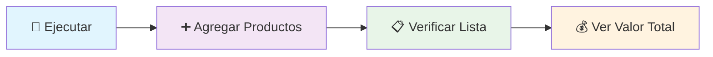

# 🚀 Guía Rápida - Sistema de Inventario POO

<div align="center">


</div>

---

## ⚡ **Inicio Rápido**

### 🎯 **1. Ejecutar el Sistema**
```bash
python trabajo_2_Sistema_Inventario_POO.py
```

### 🎮 **2. Menú Principal - Opciones Disponibles**

<table>
<tr>
<td width="50">

**🔢**

</td>
<td width="200">

**🛠️ Función**

</td>
<td>

**📝 Descripción**

</td>
</tr>
<tr><td align="center">

**1**

</td><td>

**➕ Agregar producto**

</td><td>

Crear nuevos productos en el inventario

</td></tr>
<tr><td align="center">

**2**

</td><td>

**🔍 Buscar producto**

</td><td>

Encontrar productos por nombre (insensible a mayúsculas)

</td></tr>
<tr><td align="center">

**3**

</td><td>

**📋 Listar productos**

</td><td>

Ver inventario completo con estadísticas

</td></tr>
<tr><td align="center">

**4**

</td><td>

**💰 Calcular valor total**

</td><td>

Obtener valor monetario del inventario

</td></tr>
<tr><td align="center">

**5**

</td><td>

**💲 Actualizar precio**

</td><td>

Modificar precios de productos existentes

</td></tr>
<tr><td align="center">

**6**

</td><td>

**📦 Actualizar cantidad**

</td><td>

Modificar stock de productos existentes

</td></tr>
<tr><td align="center">

**7**

</td><td>

**🗑️ Eliminar producto** 🆕

</td><td>

Quitar productos del inventario con confirmación

</td></tr>
<tr><td align="center">

**8**

</td><td>

**⚙️ Configurar sistema** 🆕

</td><td>

Activar/desactivar actualización automática

</td></tr>
<tr><td align="center">

**9**

</td><td>

**🚪 Salir**

</td><td>

Cerrar el programa de forma segura

</td></tr>
</table>

---

## 🎯 **Flujo de Trabajo Típico**

### 🆕 **Primera Vez (Setup Inicial)**


### 📊 **Gestión Diaria**


---

## ⚠️ **Validaciones y Reglas**

<table>
<tr>
<th width="120">

🏷️ **Campo**

</th>
<th width="200">

✅ **Válido**

</th>
<th>

❌ **Inválido**

</th>
</tr>
<tr>
<td align="center">

**📝 Nombre**

</td>
<td>

`"Laptop Dell"`, `"Mouse"`

</td>
<td>

`""` (vacío), `"   "` (espacios)

</td>
</tr>
<tr>
<td align="center">

**💰 Precio**

</td>
<td>

`1200.50`, `25.99`, `0`

</td>
<td>

`-100`, `"abc"`, valores negativos

</td>
</tr>
<tr>
<td align="center">

**📦 Cantidad**

</td>
<td>

`10`, `0`, `1000`

</td>
<td>

`-5`, `1.5`, `"texto"`

</td>
</tr>
</table>

---

## 🎪 **Funciones Avanzadas**

### 🤖 **Modo Actualización Automática**

<div align="center">

| 🔧 **Configuración** | 📋 **Comportamiento** |
|:---:|:---|
| 🟢 **Activado** | Los productos duplicados se suman automáticamente |
| 🔴 **Desactivado** | Solicita confirmación antes de actualizar duplicados |

</div>

**Para cambiar**: Opción 8 → `s` (activar) / `n` (desactivar)

### 🛡️ **Confirmaciones de Seguridad**
- **🗑️ Eliminar producto**: Siempre pide confirmación
- **➕ Productos duplicados**: Solo en modo manual

---

## 🔧 **Solución de Problemas**

<details>
<summary><b>🚨 Errores Comunes y Soluciones</b></summary>

### 📁 **Error: "Archivo no encontrado"**
```bash
# Verificar ubicación
ls trabajo_2_Sistema_Inventario_POO.py

# Navegar al directorio correcto
cd ruta/al/archivo
```

### 🐍 **Error: "Python no reconocido"**
```bash
# Verificar instalación
python --version

# Usar python3 si es necesario
python3 trabajo_2_Sistema_Inventario_POO.py
```

### 📦 **Error: "No se puede importar"**
- ⚠️ **No usar como import**
- ✅ **Ejecutar directamente**: `python trabajo_2_Sistema_Inventario_POO.py`

</details>

---

## 🧪 **Datos de Prueba Sugeridos**

<div align="center">

### 💻 **Productos Tecnológicos**

| 🏷️ **Producto** | 💰 **Precio** | 📦 **Cantidad** |
|:---|---:|---:|
| 💻 Laptop Dell XPS | $1,200.50 | 10 |
| 🖱️ Mouse Inalámbrico | $25.99 | 50 |
| ⌨️ Teclado Mecánico | $89.99 | 25 |
| 🖥️ Monitor 24" 4K | $299.99 | 15 |
| 📹 Webcam HD | $79.99 | 30 |

</div>

---

## 📚 **Documentación Completa**

<div align="center">

| 📄 **Documento** | 📊 **Propósito** | 🔗 **Archivo** |
|:---:|:---|:---|
| 🎯 **Técnica** | Referencia completa | `DOCUMENTACION_TECNICA_TRABAJO2.md` |
| 📈 **Ejecutiva** | Evaluación académica | `RESUMEN_EJECUTIVO_TRABAJO2.md` |
| ⚡ **Rápida** | Guía de uso | `INSTRUCCIONES_RAPIDAS.md` |

</div>

---

## 👩‍💻 **Información del Desarrollador**

<div align="center">

### 🌟 **Lorelay Pricop Florescu**

**🎓 Titulación**: Graduada en Tecnología Interactiva  
**💼 Perfil**: Tecnóloga y Project Manager  
**📚 Formación Actual**: Máster en IA - UNIR  

[](https://www.linkedin.com/in/lorelaypricop)
[](mailto:lorelaypricop@gmail.com)

</div>

---

<div align="center">

**🎓 Sistema de Inventario POO - UNIR**  
*Proyecto académico del Máster en Inteligencia Artificial*

[📋 **Documentación Técnica**](DOCUMENTACION_TECNICA_TRABAJO2.md) • [📊 **Resumen Ejecutivo**](RESUMEN_EJECUTIVO_TRABAJO2.md) • [📖 **README Principal**](../README.md)

---

**UNIVERSIDAD INTERNACIONAL DE LA RIOJA**  
*Máster Universitario en Inteligencia Artificial*  
*Curso de Programación en Python*


</div>