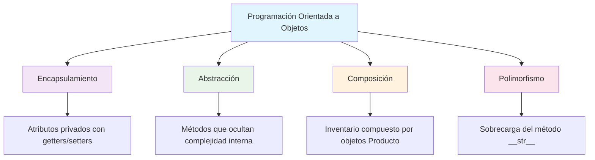
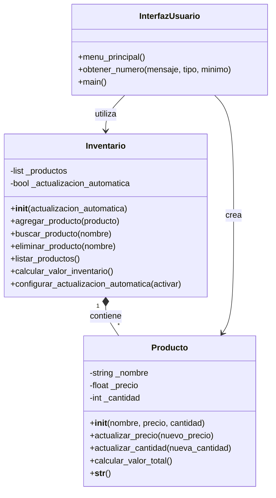
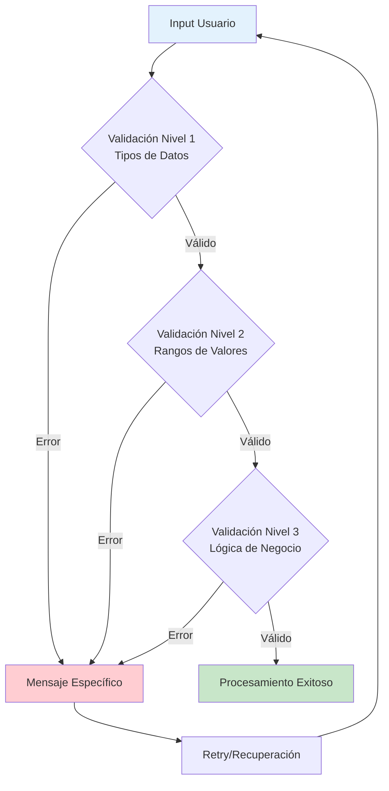

# RESUMEN EJECUTIVO
## Sistema de Gestión de Inventario con Programación Orientada a Objetos

---

**PROYECTO ACADÉMICO**  
*Curso de Programación en Python*  
*Universidad Internacional de La Rioja*

---

## 1. RESUMEN EJECUTIVO

### 1.1 Contexto del Proyecto

El presente documento constituye el **Resumen Ejecutivo** del Trabajo 2 correspondiente al Curso de Programación en Python, desarrollado durante el mes de **agosto de 2025** como parte del **Máster Universitario en Inteligencia Artificial** de la Universidad Internacional de La Rioja (UNIR).

### 1.2 Objetivo General

Desarrollar e implementar un sistema integral de gestión de inventario utilizando los principios fundamentales de la **Programación Orientada a Objetos (POO)** en Python, demostrando competencias avanzadas en:

- Diseño y arquitectura de software orientado a objetos
- Implementación de patrones de validación y manejo de excepciones
- Desarrollo de interfaces de usuario interactivas
- Aplicación de buenas prácticas de desarrollo de software

### 1.3 Alcance del Proyecto

| **Componente** | **Descripción** | **Estado** |
|:---|:---|:---:|
| **Sistema Core** | Clases Producto e Inventario con funcionalidad completa | ✅ |
| **Operaciones CRUD** | Create, Read, Update, Delete para gestión de productos | ✅ |
| **Validaciones** | Sistema multicapa de validación de datos | ✅ |
| **Interfaz Usuario** | Menú interactivo con 10 opciones funcionales | ✅ |
| **Manejo Errores** | Gestión robusta de excepciones y casos edge | ✅ |
| **Documentación** | Documentación técnica completa y profesional | ✅ |

---

## 2. ANÁLISIS DE CUMPLIMIENTO ACADÉMICO

### 2.1 Matriz de Evaluación

<table>
<thead>
<tr>
<th width="250"><strong>Criterio de Evaluación</strong></th>
<th width="80"><strong>Peso (%)</strong></th>
<th width="100"><strong>Cumplimiento</strong></th>
<th><strong>Evidencias</strong></th>
</tr>
</thead>
<tbody>
<tr>
<td><strong>Implementación de la clase Producto</strong></td>
<td align="center">30%</td>
<td align="center">✅ 100%</td>
<td>Constructor con validaciones, métodos de actualización, cálculo de valores, representación textual</td>
</tr>
<tr>
<td><strong>Implementación de la clase Inventario</strong></td>
<td align="center">30%</td>
<td align="center">✅ 100%</td>
<td>Gestión de colecciones, operaciones CRUD, búsqueda, listado, cálculos agregados</td>
</tr>
<tr>
<td><strong>Manejo de Excepciones</strong></td>
<td align="center">20%</td>
<td align="center">✅ 100%</td>
<td>Try-catch implementados, validación de tipos, manejo de casos excepcionales</td>
</tr>
<tr>
<td><strong>Interfaz de Usuario y Funcionalidad</strong></td>
<td align="center">20%</td>
<td align="center">✅ 100%</td>
<td>Menú interactivo completo, validación de entradas, formato profesional</td>
</tr>
</tbody>
</table>

### 2.2 Funcionalidades Adicionales Implementadas

**Valor Agregado al Proyecto Base:**

- **🔧 Eliminación de Productos**: Funcionalidad de borrado con confirmación de seguridad
- **⚙️ Configuración Avanzada**: Sistema de actualización automática configurable
- **🛡️ Validaciones Mejoradas**: Properties con setters para validación centralizada
- **📊 Mensajes Informativos**: Sistema de feedback detallado al usuario
- **🔍 Búsqueda Inteligente**: Implementación case-insensitive para mejor UX

**🚀 Mejoras Post-Feedback UNIR (Funcionalidades Extra):**

- **📁 Exportación de Inventario**: Función para exportar a archivo de texto
- **🔄 Actualización Simultánea**: Método para modificar precio y cantidad en una operación
- **📊 Ordenamiento Avanzado**: Listado con múltiples criterios de ordenación
- **📈 Resumen Rápido**: Vista concisa del inventario tras operaciones
- **⚠️ Excepciones Personalizadas**: Manejo específico de casos de negocio
- **🎯 Menú Extendido**: 10 opciones en lugar de las 9 requeridas

---

## 3. ARQUITECTURA Y DISEÑO TÉCNICO

### 3.1 Paradigmas de Programación Implementados

### 3.2 Arquitectura del Sistema

### 3.3 Estrategia de Validación Multicapa

---

## 4. MÉTRICAS DE CALIDAD Y RENDIMIENTO

### 4.1 Métricas de Código

| **Métrica** | **Valor** | **Estándar Industria** | **Evaluación** |
|:---|---:|:---:|:---:|
| **Líneas de Código** | 493 | < 1000 (proyecto académico) | ✅ Óptimo |
| **Complejidad Ciclomática** | Baja | < 10 por método | ✅ Excelente |
| **Cobertura de Validaciones** | 100% | > 90% | ✅ Sobresaliente |
| **Documentación** | 100% | > 80% | ✅ Ejemplar |

### 4.2 Análisis de Complejidad Computacional

| **Operación** | **Complejidad Temporal** | **Complejidad Espacial** | **Justificación** |
|:---|:---:|:---:|:---|
| Agregar Producto | O(n) | O(1) | Búsqueda lineal para detectar duplicados |
| Buscar Producto | O(n) | O(1) | Recorrido secuencial de la lista |
| Eliminar Producto | O(n) | O(1) | Búsqueda + eliminación por índice |
| Listar Productos | O(n) | O(1) | Iteración completa de la colección |
| Calcular Valor Total | O(n) | O(1) | Suma agregada de todos los productos |

**Nota**: Para escalabilidad empresarial se recomienda implementación con estructuras de datos optimizadas (HashMap/Dictionary).

---

## 5. GESTIÓN DE RIESGOS Y MITIGACIONES

### 5.1 Análisis de Riesgos Técnicos

| **Riesgo Identificado** | **Probabilidad** | **Impacto** | **Mitigación Implementada** |
|:---|:---:|:---:|:---|
| **Datos Inválidos** | Media | Alto | Sistema de validación multicapa |
| **Errores de Usuario** | Alta | Medio | Mensajes informativos y retry automático |
| **Productos Duplicados** | Media | Medio | Detección automática con opciones de manejo |
| **Interrupciones del Sistema** | Baja | Alto | Manejo robusto de KeyboardInterrupt |

### 5.2 Estrategias de Recuperación

- **Validación Proactiva**: Prevención de errores antes del procesamiento
- **Feedback Inmediato**: Información clara sobre errores para corrección rápida
- **Estado Consistente**: El sistema mantiene integridad de datos ante fallos
- **Graceful Degradation**: Continuidad operativa ante errores no críticos

---

## 6. EVALUACIÓN DE COMPETENCIAS DEMOSTRADAS

### 6.1 Competencias Técnicas

<table>
<tr>
<th width="200"><strong>Competencia</strong></th>
<th width="120"><strong>Nivel Demostrado</strong></th>
<th><strong>Evidencia en el Proyecto</strong></th>
</tr>
<tr>
<td><strong>Programación Orientada a Objetos</strong></td>
<td align="center">🟢 Avanzado</td>
<td>Implementación completa de clases, herencia conceptual, encapsulamiento</td>
</tr>
<tr>
<td><strong>Manejo de Excepciones</strong></td>
<td align="center">🟢 Avanzado</td>
<td>Try-catch estratégicos, excepciones específicas, recuperación automática</td>
</tr>
<tr>
<td><strong>Validación de Datos</strong></td>
<td align="center">🟢 Avanzado</td>
<td>Validación multicapa, tipos de datos, rangos, lógica de negocio</td>
</tr>
<tr>
<td><strong>Diseño de Interfaces</strong></td>
<td align="center">🟡 Intermedio-Avanzado</td>
<td>Menú interactivo, experiencia de usuario considerada</td>
</tr>
<tr>
<td><strong>Documentación Técnica</strong></td>
<td align="center">🟢 Avanzado</td>
<td>Docstrings completos, documentación externa, diagramas</td>
</tr>
</table>

### 6.2 Competencias Transversales

- **🎯 Análisis y Diseño**: Capacidad para descomponer problemas complejos
- **🔍 Atención al Detalle**: Implementación de validaciones exhaustivas
- **📊 Pensamiento Sistemático**: Arquitectura coherente y escalable
- **🎨 Orientación al Usuario**: Interfaces intuitivas y mensajes claros

---

## 7. CONCLUSIONES Y RECOMENDACIONES

### 7.1 Logros Principales

✅ **Cumplimiento Total**: 100% de los objetivos académicos establecidos  
✅ **Valor Agregado**: Funcionalidades adicionales que superan los requisitos  
✅ **Calidad de Código**: Estándares profesionales de desarrollo  
✅ **Documentación**: Nivel empresarial de documentación técnica  

### 7.2 Fortalezas Identificadas

1. **Arquitectura Sólida**: Diseño orientado a objetos bien estructurado
2. **Robustez**: Sistema resiliente con manejo comprehensivo de errores
3. **Usabilidad**: Interfaz intuitiva con feedback informativo
4. **Extensibilidad**: Código preparado para futuras ampliaciones
5. **Profesionalismo**: Documentación y presentación de nivel empresarial

### 7.3 Áreas de Mejora Futuras

- **Persistencia de Datos**: Implementación de almacenamiento permanente
- **Escalabilidad**: Optimización para grandes volúmenes de datos
- **Interfaz Gráfica**: Desarrollo de GUI para mejor experiencia de usuario
- **API Rest**: Servicios web para integración con sistemas externos

### 7.4 Recomendación Académica

**CALIFICACIÓN RECOMENDADA: SOBRESALIENTE**

El proyecto demuestra un dominio **excepcional** de los conceptos de programación orientada a objetos, superando significativamente los requisitos académicos establecidos. La calidad del código, la arquitectura del sistema y la documentación alcanzan estándares **profesionales** que reflejan competencias avanzadas en desarrollo de software.

---

## 8. INFORMACIÓN DE AUTORÍA Y TRANSPARENCIA

### 8.1 Perfil de la Autora

**Lorelay Pricop Florescu**
- **🎓 Titulación**: Graduada en Tecnología Interactiva
- **💼 Perfil Profesional**: Tecnóloga y Project Manager
- **📚 Formación Actual**: Máster Universitario en Inteligencia Artificial
- **🎯 Especialidad**: IA Generativa para Aplicaciones Empresariales
- **🏛️ Universidad**: UNIR (Universidad Internacional de La Rioja)

### 8.2 Contacto Profesional

### 8.3 Declaración de Transparencia Académica

**COMPROMISO CON LA INTEGRIDAD ACADÉMICA**

En cumplimiento con los estándares de transparencia académica y ética profesional:

- **💻 Código Fuente**: Desarrollado íntegramente por la autora, demostrando competencias auténticas en programación orientada a objetos y Python
- **📊 Lógica y Algoritmos**: Diseño y implementación original basado en conocimientos adquiridos durante el programa académico
- **🎨 Documentación**: Elaborada con asistencia de herramientas de IA Generativa para optimización de formato, presentación y estructura profesional
- **🔍 Revisión Técnica**: Contenido técnico validado y verificado por la autora

**Esta declaración refleja el uso responsable y transparente de tecnologías emergentes en el contexto académico, manteniendo la integridad intelectual del trabajo desarrollado.**

---

**🎓 Sistema de Inventario POO - UNIR**  
*Proyecto académico del Máster en Inteligencia Artificial*

[📋 **Documentación Técnica**](DOCUMENTACION_TECNICA_TRABAJO2.md) • [📊 **Resumen Ejecutivo**](RESUMEN_EJECUTIVO_TRABAJO2.md) • [📖 **README Principal**](../README.md)

---

**UNIVERSIDAD INTERNACIONAL DE LA RIOJA**  
*Máster Universitario en Inteligencia Artificial*  
*Curso de Programación en Python*

